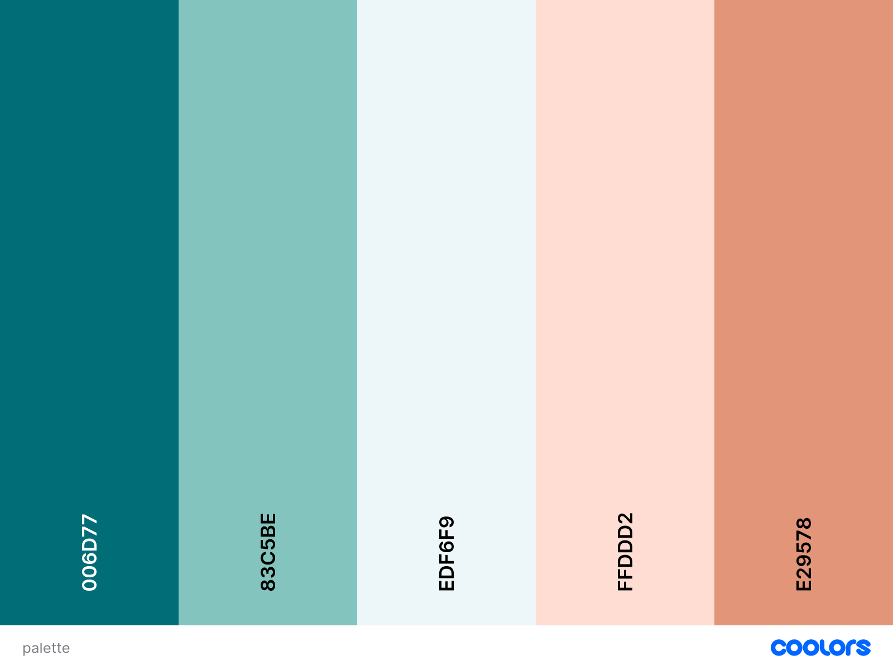

# Milestone Project 2 – Vegan Recipe Finder

## Overview
**Vegan Recipe Finder** is an interactive front‑end web application that helps users discover vegan recipes based on the ingredients they have at home. It integrates with the Spoonacular API to:

- Add multiple ingredients as removable tags  
- Apply optional filters (Gluten‑Free, High‑Protein, Quick Meals)  
- Display results in a modern, responsive card grid with shortened summaries  
- Save favorites via a ★/☆ toggle and view them in a separate grid  
- Open a **View Recipe** modal with a full‑size image, detailed description, and step‑by‑step instructions  

**Live Site:** [Vegan Recipe Finder on GitHub Pages](https://carlssonanton87.github.io/milestone-project-2/)

---
## CONTENTS

* [User Experience (UX)](#user-experience-ux)  
  * [User Stories](#user-stories)  
* [Design](#design)  
  * [Colour Scheme](#colour-scheme)  
  * [Typography](#typography)  
  * [Imagery](#imagery)  
  * [Wireframes](#wireframes)  
* [Features](#features)  
  * [General Features on Each Page](#general-features-on-each-page)  
  * [Future Implementations](#future-implementations)  
  * [Accessibility](#accessibility)  
* [Technologies Used](#technologies-used)  
  * [Languages Used](#languages-used)  
  * [Frameworks, Libraries & Programs Used](#frameworks-libraries--programs-used)  
* [Deployment & Local Development](#deployment--local-development)  
  * [Deployment](#deployment)  
  * [Local Development](#local-development)  
    * [How to Fork](#how-to-fork)  
    * [How to Clone](#how-to-clone)  
* [Testing](#testing)  
* [Credits](#credits)  
  * [Code Used](#code-used)  
  * [Content](#content)  
  * [Media](#media)  
  * [Acknowledgments](#acknowledgments)  

---

## User Experience

**Vegan Recipe Finder** exists to simplify meal planning for anyone cooking plant‑based at home. Too often, home cooks end up with forgotten veggies and pantry staples—then waste time hunting through multiple websites for a recipe that matches what they already have. This app lets users:

- **Enter exactly what’s in their kitchen** and get instant vegan recipe suggestions  
- **Apply dietary filters** (gluten‑free, high‑protein, quick meals) to match personal needs  
- **Save favorite recipes** for easy access later  
- **View full step‑by‑step instructions** and images in a clean, interactive modal  

By reducing recipe hunting to a few clicks, Vegan Recipe Finder helps users save time, reduce food waste, and explore new plant‑based dishes tailored to their own pantry.  


### User Stories

- **First‑time Visitor**  
  “As a first‑time visitor, I want to quickly find vegan recipes using ingredients I already have, so I don’t waste time searching unrelated recipes.”

- **Returning User**  
  “As a returning user, I want to save my favorite recipes so I can easily revisit them later.”

- **Health‑Conscious User**  
  “As someone with dietary restrictions, I want to filter recipes (e.g., gluten‑free, high‑protein) to meet my needs.”

---

## Design


### Colour Scheme

I selected this five‑tone palette to reflect both freshness and warmth, perfect for a vegan cooking app:

- **#006d77 (Deep Teal):** Anchors the design with a calm, trustworthy tone for headers and primary actions.  
- **#83c5be (Turquoise):** Soft secondary color for buttons and borders, suggesting vitality and clarity.  
- **#edf6f9 (Pale Aqua):** Clean, airy background that keeps the interface light and lets content breathe.  
- **#ffddd2 (Soft Peach):** Gentle section backgrounds (ingredients & filters) that add warmth without overpowering.  
- **#e29578 (Muted Coral):** Accent color for tags and highlights, injecting energy and guiding the eye to key elements.  

Together, these hues balance each other—cool greens and teals set a fresh, health‑focused mood, while the peach and coral bring a friendly, appetizing warmth.```

  
*Colour palette generated by coloors.co*

### Typography

I used **Montserrat** from Google Fonts:
- **Weights:** 400 (regular) & 600 (semi‑bold)  
- **Reason:** Clean, modern, and highly legible on both desktop and mobile.

### Imagery

Recipe images are fetched from the Spoonacular API. They’re cropped and displayed at 160 px height with `object-fit: cover` to maintain a consistent look.

### Wireframes

Wireframes were created bu using Visily.ai
<details>
<summary>Ingredient input, filters, and search.</summary>
<br>


</details>

<details>
<summary>Recipe card grid and modal design</summary>
<br>


</details>

---

## Features
### General Features 

- **Header & Nav:** Title and links to Home (results) & Favorites.  
- **Ingredient Section:** Input + button to add tags.  
- **Filter Section:** Checkboxes for additional dietary filters.  
- **Results Grid:** Responsive CSS Grid of recipe cards.  
- **Favorites Grid:** Separate grid for saved recipes.  
- **Modal:** Popup for full recipe details.

### Functionality

1. **Add Ingredients**  
   - Type an ingredient and click **+** to create a removable tag.
2. **Apply Filters**  
   - Tick any of **Gluten‑Free**, **High‑Protein**, or **Quick Meals** to narrow results.
3. **Search Recipes**  
   - Click **Search Recipes** to fetch custom vegan recipes.
4. **Browse Cards**  
   - Scroll a responsive grid of recipe cards showing image, title, and a short snippet.
5. **View Details**  
   - Click **View Recipes** on any card to open a modal with full recipe info.
6. **Save Favorites**  
   - Click the star icon (☆/★) to toggle favorites, which appear in their own grid.

### Future Implementations

- **Nutritional Info:** Show calories, macros per recipe.  
- **User Ratings:** Allow users to rate & review recipes.  
- **Authentication:** Save favorites per user account.


### Accessibility

- **Alt Text:** All images include `alt` attributes.  
- **Keyboard Focus:** Buttons are focusable; modal traps focus.  
- **Contrast:** Meets WCAG AA for text/background pairs.


## Technologies Used

### Languages Used

- HTML5  
- CSS3  
- JavaScript 

### Frameworks, Libraries & Programs Used

- **Spoonacular API** – Recipe data.  
- **Google Fonts** – Montserrat.  
- **Git & GitHub Pages** – Version control & hosting.  
- **Live Server (VS Code)** – Local preview.  
- **Chrome DevTools** – Debugging & responsiveness.  
- **W3C Validators** – Code validation.
- [Coolors](https://coolors.co/) - To select the colour palette for the site.
- [Shields.io](https://shields.io/) To add badges to the README
- [Visily](https://visily.ai/) - To create wireframes for the site


---

## Deployment & Local Development

### Deployment

The site is deployed using GitHub Pages. Visit the deployed site [here.](https://github.com/carlssonanton87/milestone-project-2) To deploy using GitHub pages:

1. Login or Sign Up to GitHub.
2. Open the project repository.
3. Click on "Settings" on the navigation bar under the repository title.
4. Click on "Pages" in the left hand navigation panel.
5. Under "Source", choose which branch to deploy. This should be Main for newer repositories (older repositories may still use Master).
6. Choose which folder to deploy from, usually "/root".
7. Click "Save", then wait for it to be deployed. It can take some time for the page to be fully deployed.
8. Your URL will be displayed above "Source".

### Local Development

#### How to Fork

To fork the repository:

1. Log in (or sign up) to Github.
2. Go to the repository for this project, [here](https://github.com/carlssonanton87/milestone-project-2).
3. Click the Fork button in the top right corner.

#### How to Clone

To clone the repository:

1. Log in (or sign up) to GitHub.
2. Go to the repository for this project, [here](https://github.com/carlssonanton87/milestone-project-2).
3. Click on the code button, select whether you would like to clone with HTTPS, SSH or GitHub CLI and copy the link shown.
4. Open the terminal in your code editor and change the current working directory to the location you want to use for the cloned directory.
5. Type 'git clone' into the terminal and then paste the link you copied in step 3. Press enter.

- - -


## Testing

### Manual Testing Principles
I opted for manual testing in this phase because it let me exercise and validate each interactive flow—adding/removing ingredients, toggling favorites, opening/closing the modal—directly in the browser. Manual checks helped catch UI quirks, accessibility focus issues, and asynchronous timing edge‑cases more quickly than setting up an automated suite. Once the core functionality is solid, I plan to introduce automated unit and integration tests to guard against regressions.

- **Testing Process:** I manually exercised every user flow in Chrome, Firefox and Safari (desktop + mobile emulation), validated HTML/CSS with the W3C validators, checked for console errors in DevTools, and tested keyboard navigation/aria‑label announcements to ensure accessibility.

- **Manual Flows**  
  Verifying interactive behaviors (adding/removing ingredients, favorites, modal open/close) by hand.
- **Edge Cases**  
  Checking empty inputs, slow network behavior, and error displays.

### Test Cases & Results

1. **Search with No Ingredients**  
   - **Steps:** Click **Search Recipes** without adding any tags.  
   - **Expected:** Console logs “No ingredients selected.” No API call made.  
   - **Result:** ✅ Pass

2. **Add & Remove Ingredient Tags**  
   - **Steps:** Add “tofu”, “spinach”; click the ✕ on “spinach”.  
   - **Expected:** Only “tofu” remains displayed.  
   - **Result:** ✅ Pass

3. **Fetch & Display Recipes**  
   - **Steps:** Add at least one ingredient and click **Search Recipes**.  
   - **Expected:** 10 recipe cards load with image, title, and shortened summary.  
   - **Result:** ✅ Pass

4. **Favorite a Recipe & Persistence**  
   - **Steps:** Click ★ on a recipe card, then refresh the page.  
   - **Expected:** That card remains starred and appears in Favorites.  
   - **Result:** ✅ Pass

5. **Open & Close Modal**  
   - **Steps:** Click **View recipe** on any card; click × or outside the modal.  
   - **Expected:** Modal opens with full details, then closes.  
   - **Result:** ✅ Pass

6. **Invalid API Response Handling**  
   - **Steps:** Temporarily remove API key and search again.  
   - **Expected:** Error message displays: “Error fetching recipes. Please try again later.”  
   - **Result:** ✅ Pass

### Screenshots

- **Adding & Removing Tags**  
  

- **Recipe Grid & Favorites**  
  

- **Full Recipe Modal**  
  


---

## Credits


### Code Used

- **shortenText Function (Text Truncation)**  
  - Truncate text logic inspired by freeCodeCamp’s “Truncate Text with JavaScript” guide:  
    https://www.freecodecamp.org/news/truncate-text-with-javascript  

- **Equal‑Height CSS Grid Cards**  
  - `grid-auto-rows: 1fr` technique for equal‑height rows from CSS‑Tricks:  
    https://css-tricks.com/snippets/css/complete-guide-grid/#equal-height-columns  

- **Spoonacular API Integration**  
  - “Find Recipes by Ingredients” & “Get Recipe Information” endpoints from the official docs:  
    https://spoonacular.com/food-api/docs#Search-Recipes-from-Ingredients  
    https://spoonacular.com/food-api/docs#Get-Recipe-Information  

- **CSS Loading Spinner**  
  - Keyframe spinner animation technique adapted from CSS‑Tricks:  
    https://css-tricks.com/snippets/css/simple-css-spinner  

- **localStorage Persistence**  
  - `localStorage.setItem()` / `getItem()` usage examples on MDN Web Docs:  
    https://developer.mozilla.org/en-US/docs/Web/API/Window/localStorage 

### Content

All site content (labels, instructions, error messages) authored by me.

### Media

- Recipe images from Spoonacular API.  
- Wireframe mockups created with Visily.

### Acknowledgments

- Thanks to my mentor and the CI community for guidance on API integration and responsive design.  
- Special shout‑out to peers for UX feedback during peer reviews.


---

## Bug Fixes
### Bug: API Fetch Failing Initially
- **Description:**  
  First fetch attempt failed because our script ran before the DOM was ready and the results container wasn’t defined.  
- **Impact:**  
  No recipes displayed on search, blocking API integration testing.  
- **Resolution:**  
  Wrapped all DOM queries and event listeners inside a `DOMContentLoaded` handler and ensured `resultsContainer` is correctly selected.  
- **Status:**  
  Fixed in commit `feat: Integrate Spoonacular API with real data and wrap code in DOMContentLoaded`.

---

## Development Process
1. **Initial Setup**  
   Created base HTML, CSS, and JavaScript scaffolding; set up GitHub repo.  
2. **Ingredient Tag & Filter System**  
   Built dynamic ingredient‑tag component and filter checkboxes.  
3. **API Integration**  
   Integrated Spoonacular’s `complexSearch` endpoint with `diet=vegan` and added filter parameters.  
4. **Recipe Card Layout**  
   Designed a responsive CSS Grid of recipe cards, each with an image, title, and truncated summary.  
5. **Favorites Functionality**  
   Added a star toggle to save favorites, displayed in a separate responsive grid.  
6. **Full Recipe Modal**  
   Implemented a modal that fetches and shows full recipe details (image, summary, instructions).  
7. **Summary Shortening**  
   Added helper functions to strip HTML and shorten long summaries for improved readability.  
