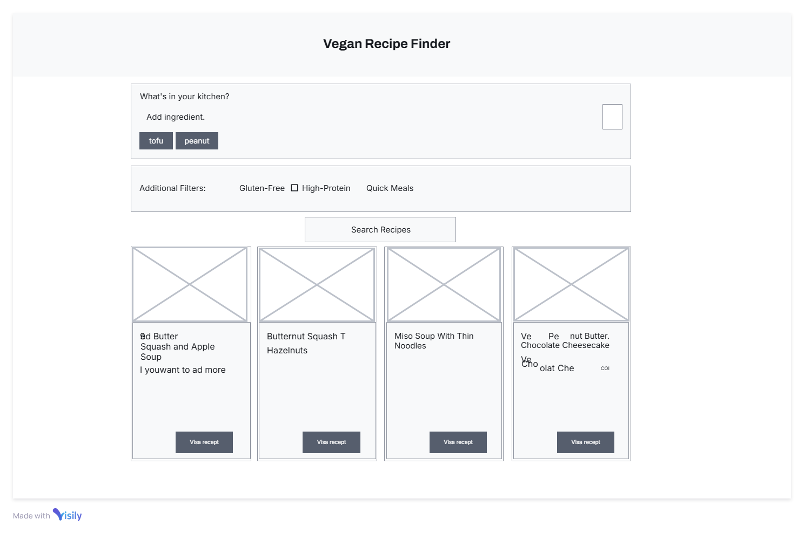
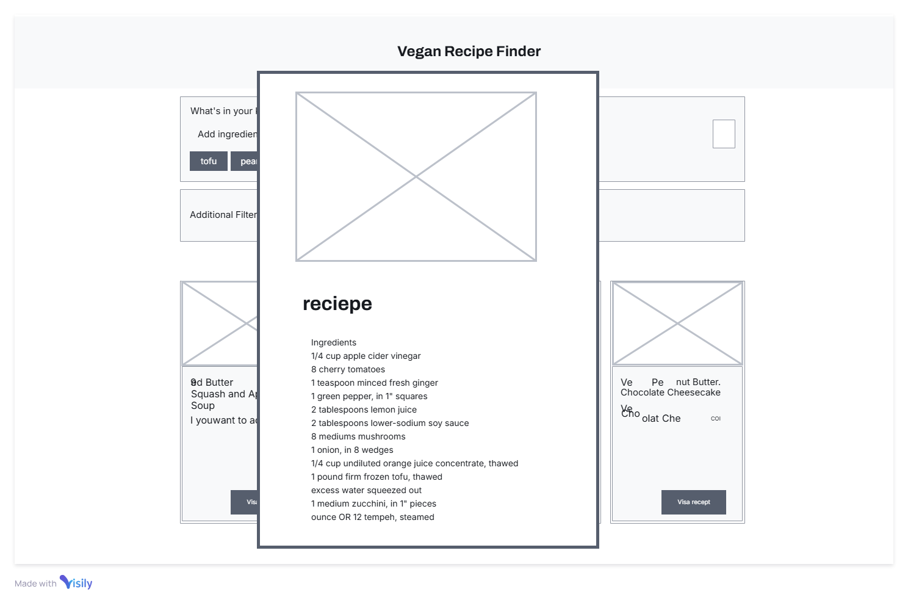

# Milestone Project 2 - Vegan Recipe Finder

## Overview
Vegan Recipe Finder is an interactive front-end web application designed to help users discover vegan recipes based on the ingredients they have available. The project integrates with the Spoonacular API to fetch vegan recipes according to the following user inputs:

- **Ingredient Input:** Users add ingredients as tags.
- **Filter Options:** Additional filters (Gluten-Free, High-Protein, Quick Meals) refine recipe searches.
- **Recipe Cards:** Recipes are displayed in a modern card layout with a shortened summary for readability.
- **Favorites:** Users can save recipes using a star icon toggle and view them in a responsive grid.
- **Full Recipe Modal:** Clicking "Visa recept" opens a modal with a detailed view including an enlarged image, full description, and step-by-step instructions.

## Features
- **Multiple Ingredient Input:**  
  Users can add ingredients which are displayed as removable tags.
- **Dynamic Filters:**  
  Options to include Gluten-Free, High-Protein, and Quick Meals filters.
- **API Integration:**  
  Uses Spoonacular’s `complexSearch` endpoint with `diet=vegan` for tailored vegan recipes.
- **Detailed Recipe Display:**  
  Recipe cards show an image, title, and a summary that shortens lengthy descriptions.
- **Favorite Functionality:**  
  Favoriting a recipe is done via a star icon (empty star for un-favorited, filled star for favorited), and favorites are displayed in a responsive grid.
- **Modal for Full Details:**  
  The "Visa recept" button opens a modal that fetches and displays full recipe details including a full image, detailed description, and cooking instructions.

## Technologies Used
- **HTML5, CSS3, and JavaScript** for the client-side interface.
- **Spoonacular API** to fetch recipe data.
- **CSS Grid & Flexbox** for responsive layout.
- **Git & GitHub** for version control and repository hosting.

## Technologies Used
- **HTML5, CSS3, and JavaScript** – For front-end development.
- **Spoonacular API** – To fetch vegan recipe data.
- **CSS Grid and Flexbox** – For responsive layouts.
- **Git & GitHub** – For version control and hosting.

## Usage
- **Adding Ingredients:**  
  Enter an ingredient in the input field and click the plus (+) button. Each ingredient appears as a removable tag.
- **Filtering:**  
  Optionally select any additional filters before searching.
- **Searching for Recipes:**  
  Click the **Search Recipes** button to fetch vegan recipes based on your selected ingredients and filters.
- **Viewing Recipe Details:**  
  Click "Visa recept" on a recipe card to open a modal showing detailed recipe information.
- **Saving Favorites:**  
  Click the star icon on a card to toggle it as a favorite. Favorites appear in a dedicated grid section.

## Development Process
1. **Initial Setup:**  
   Set up basic HTML, CSS, and JavaScript files.
2. **Ingredient Tag & Filter System:**  
   Developed dynamic ingredient input tags and filtering options.
3. **API Integration:**  
   Integrated the Spoonacular API (with `diet=vegan` and additional filters) to fetch recipes.
4. **Recipe Card Layout:**  
   Designed a responsive grid layout for recipe cards that include images, titles, and shortened summaries.
5. **Favorite Functionality:**  
   Enabled favoriting through a star icon, with saved recipes shown in a grid.
6. **Full Recipe Modal:**  
   Implemented a modal that retrieves and displays detailed recipe information, including an enlarged image, full description, and cooking instructions.
7. **Summary Shortening:**  
   Added helper functions to strip HTML and shorten lengthy summaries for readability.

## Known Issues / Future Enhancements
- **API Rate Limits:**  
  Spoonacular's free tier has request limits. Consider caching responses or upgrading your plan if necessary.
- **Error Handling:**  
  Further improvements can be made in error management and fallback UI.
- **Enhanced Data:**  
  Future updates could include nutritional information, user reviews, and additional recipe details.
- **UI/UX Improvements:**  
  Additional refinements for accessibility and mobile responsiveness are planned.

## Setup
Instructions to install and run the project will be provided here.

## Wireframes

## Bug Log

### Bug: API Fetch Failing Initially
- **Description:** When attempting to fetch recipes from the Spoonacular API, nothing was displayed because the API call was failing. The issue was due to the script not being wrapped in a `DOMContentLoaded` event listener and the results container not being defined properly.
- **Impact:** Users could not see any recipes when performing a search, which impeded progress testing the API integration.
- **Resolution:** The bug was fixed in commit `feat: Integrate Spoonacular API with real data using provided API key and update display logic`, where the JavaScript code was updated to wrap all functionality within a `DOMContentLoaded` event listener and properly define and reference the results container.
- **Status:** Fixed

### Tools
- **Git & GitHub** for version control.
- **Gitpod** as the development environment.    
- **Visual Studio Code** as the development environment.  
- **Live Server Extension** for live preview.  
- **W3C Validators** for HTML/CSS validation.  
- **Chrome DevTools** for responsiveness testing.