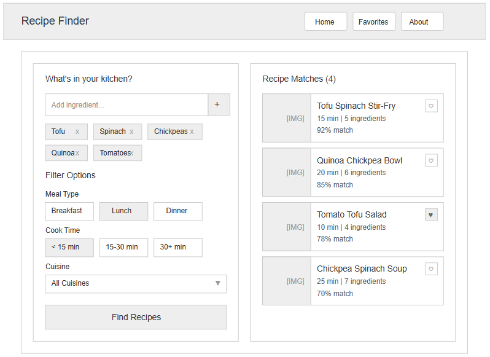

# Milestone Project 2 – Vegan Recipe Finder

## Overview
This project is an interactive web application that allows users to input the ingredients they have at home and fetch vegan recipe suggestions based on those ingredients. The app also provides filtering options for dietary preferences such as gluten-free, high-protein, and quick meals.

## MVP Features
- **Ingredient Search:** Users can input ingredients.
- **API Integration:** Fetch recipes from an external API (e.g., Spoonacular).
- **Filter Options:** Options for gluten-free, high-protein, quick meals.
- **Favorites:** Save favorite recipes for later use.

## Tech Stack
- HTML
- CSS
- JavaScript
- Integration with a recipe API (e.g., Spoonacular)

## Setup
Instructions to install and run the project will be provided here.

## Wireframes

